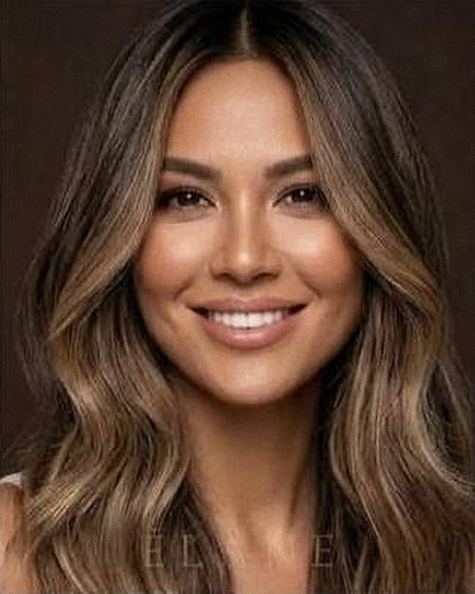

# ÉLANE

Сайт премиального женского салона красоты. Москва, Патриаршие пруды.
Одностраничник без сборки: откройте `index.html` — этого достаточно.

> **Все данные вымышлены.** Название, легенда, мастера, отзывы, цены, адрес,
> телефон и аккаунты — дизайн-концепция, а не существующая компания.
> Перед публикацией замените их на реальные.

---

## Запуск

```bash
open index.html                 # или двойной клик
python3 -m http.server 8000     # если нужен http:// (для проверки шрифтов)
```

Сборка, npm и интернет не требуются: GSAP и шрифты лежат в репозитории.

## Два скрипта в `tools/`

Нужны только при замене фотографий. Обоим требуется Pillow (`pip install Pillow`).

```bash
python3 tools/rebuild-photos.py  # пересобрать все кадры из исходников
python3 tools/make-mobile.py     # пересобрать мобильные кадры (суффикс -m)
python3 tools/pack-offline.py    # собрать весь сайт в один elane-offline.html
```

`rebuild-photos.py` собирает каждый кадр из исходного макета: обрезает по
нужному окну и увеличивает обратным проецированием (`tools/upscale.py`,
подробности в разделе «Качество фотографий»). Путь к папке с исходниками —
в переменной окружения `ELANE_SRC`. Можно пересобрать одну группу:
`python3 tools/rebuild-photos.py works masters`.

`make-mobile.py` **обязателен после любой замены кадра в `assets/`**: телефон
грузит файл с суффиксом `-m`, и без пересборки там останется старый снимок.
Список кадров и их мобильные ширины — в начале скрипта; если меняете ширину,
поправьте и число в `data-src-m` в разметке.

`pack-offline.py` складывает стили, шрифты, скрипты и все кадры внутрь одного
HTML-файла (около 3,8 МБ). Такой файл открывается двойным щелчком и работает
без сервера и без интернета — удобно отправить заказчику одним вложением.

## Структура

```
index.html                 вся разметка, секции помечены комментариями
css/main.css               токены → база → секции → адаптив → reduced-motion → печать
css/fonts/                 11 подмножеств вариативных шрифтов (192 КБ)
js/main.js                 меню, превью, до/после, отзывы, форма, анимации
js/vendor/                 GSAP 3.13 + ScrollTrigger (локально)
assets/                    кадры; файлы с суффиксом -m — мобильные версии
tools/                     два скрипта: мобильные кадры и сборка в один файл
design-system/elane/       MASTER.md — источник правды по дизайну
```

## Бренд

| | |
|---|---|
| Название | ÉLANE |
| Слоган | Почерк, а не образ |
| Signature | **ГЛАДЬ** — протокол №1, 120 минут, 24 000 ₽ |
| Адрес | Москва, Малая Бронная, 24с1, 2 этаж |
| Телефон | +7 495 120-84-16 |
| Почта | concierge@elane.ru |
| Соцсети | @elane.patriki |

Tone of voice: короткие утверждения, цифры вместо прилагательных, разговор о
ремесле и времени. Без «подчеркнём вашу красоту» и прочих штампов.

---

## Что нужно заменить перед публикацией

### 1. Портрет в герое

`assets/hero-model.webp` — снимок, который вы прислали уже обрезанным. Он на
своём тёмном студийном фоне, а не вырезан: фон подогнан по цвету под шоколадное
поле героя (сдвиг применён только к теням, кожа и блики не тронуты), края
растворены альфа-каналом. Так сохраняются натуральные волосы и контровой свет —
автоматическое матирование тёмной модели с тёмного фона выедает лицо.

На десктопе кадр стоит справа во всю высоту героя, на экранах до 1024 px — идёт
полосой во всю ширину над текстом, с кропом по лицу (`object-position: 52% 24%`).

**Проверьте права на снимок перед публикацией**: если он из стока или
сгенерирован нейросетью, условия использования в коммерческом проекте нужно
подтвердить.

Чтобы заменить портрет: если новый файл тоже на тёмном фоне, положите его в
`assets/` под тем же именем и подгоните фон под `#2A1C15`. Если фон светлый или
прозрачный — понадобится другая обработка, раскладка при этом не меняется.

**Кадр живой.** Модель медленно моргает каждые 3,5–9 секунд, а волосы качаются
двумя прядями с разными периодами. Моргание собрано из трёх кадров
`assets/hero-blink-1..3.webp` (по 4 КБ, всего 12 КБ): это тот же снимок,
в котором полоса ресниц сдвинута вниз на линию смыкания век — не рисунок,
а сдвиг настоящих пикселей. Пряди — копия основного файла из кеша, вырезанная
маской, лишних байтов не тянут.

Важно: кадры моргания привязаны к координатам глаз именно этого снимка
(глаза лежат на строках 429–470 кадра 1024×1046). **Если вы меняете портрет,
удалите `hero-blink-*.webp`** — иначе веко опустится не туда. Без этих файлов
моргания просто не будет, остальное продолжит работать. Пряди привязаны к маскам
в `css/main.css` (`.hero__hair--r`, `.hero__hair--l`) и их тоже нужно подвинуть
под новую причёску. Оба эффекта отключены при `prefers-reduced-motion`, пряди —
ещё и на экранах до 1024 px.

### 2. Кадр в секции ГЛАДЬ

`assets/sig-hair.webp` — ваш снимок волос, обрезанный под кадр секции
(714×892, 4:5, центр окна — на бликовой полосе) и подогнанный по цвету.
Фон на снимке — светлый интерьер салона, он спорил с шоколадным полем;
поэтому фон уведён в `#2A1C15` и притушен, а сами волосы не тронуты.
Разделяет их маска по высокочастотной энергии: волосы дают резкие штрихи,
размытый интерьер за ними — почти нет. Поверх лёгкая виньетка.

Рядом лежит `assets/sig-hair-sm.webp` (430 px) для узких экранов; какой из
двух брать, решает `srcset`. Рецепт обработки — в `design-system/elane/MASTER.md`.

**Права на снимок проверьте перед публикацией** — так же, как на портрет.

Чтобы заменить кадр: положите новый файл под теми же именами и поправьте
`width`/`height` у ``, если пропорции другие. Обработка не обязательна,
но светлый фон в этой секции выглядит инородно.

### 3. Превью услуг

В списке услуг при наведении (на тач-экране — по касанию) всплывает кадр.
Все девять — ваши, обрезаны под карточку 4:5 и лежат в `assets/`:

| Услуга | Файл | Сюжет |
|---|---|---|
| Стрижка и форма | `svc-cut.webp` | каре в профиль |
| Укладка | `svc-style.webp` | объёмные волны |
| Окрашивание | `svc-color.webp` | кисть, фольга, прядь |
| Сложный цвет | `svc-tone.webp` | многотональное каре |
| Уход и трихология | `svc-care.webp` | массаж головы |
| Маникюр и педикюр | `svc-nails.webp` | руки, флакон на фоне |
| Brow & Lash | `svc-brow.webp` | брови и ресницы крупно |
| Макияж | `svc-makeup.webp` | лицо крупно, сияющая кожа |
| Уход за лицом | `svc-face.webp` | сыворотка пипеткой |

**Права на снимки проверьте перед публикацией.**

Кадр задаётся атрибутом строки, а не внутри ``:

```html
<li class="svc__row" data-img="assets/svc-cut.webp">
```

Пропорции карточки — 4:5, рабочий размер 600×750. Присланные снимки были
1280×698, то есть вдвое шире карточки: в кадр попадает 44 % ширины, и центр
обрезки приходилось выбирать вручную по каждому. Если будете менять — берите
вертикальные кадры либо такие, где главное стоит по центру.

Если у строки убрать `data-img`, карточка для неё просто не всплывёт —
ломаться ничего не будет.

### 4. Портреты мастеров

Все семь — ваши, лежат в `assets/`:

| Мастер | Файл | Пропорции карточки |
|---|---|---|
| Вера Ильинская | `mst-vera.webp` | 3:2, широкая |
| Аглая Тимрот | `mst-aglaya.webp` | 4:5 |
| Ника Заборская | `mst-nika.webp` | 4:5 |
| Лев Гурьев | `mst-lev.webp` | 3:2, широкая |
| Таисия Мор | `mst-taisia.webp` | 4:5 |
| Юлия Бенуа | `mst-julia.webp` | 4:5 |
| Дина Асланова | `mst-dina.webp` | 3:2, широкая |

Шесть кадров нарезаны из присланной сетки, седьмой (Дина) пришёл отдельным
снимком. Он снят в светлом интерьере, а остальные шесть — в тёмной студии,
поэтому её кадр приведён к общему тону: средняя яркость и разброс подогнаны
под среднее по шести (перенос статистики по каналам на 65 % силы, плюс
виньетка). На полную силу получалось темно и мутно, на половину — всё ещё
выбивался из ряда.

Кадрирован он выше ножниц и расчёски: Дина — brow & lash, парикмахерский
инструмент в кадре читался бы неверно. Заодно окно подобрано так, чтобы её
голова занимала в кадре ту же долю, что и у остальных, — иначе карточка
выглядела снятой с другого расстояния.

**Шесть кадров из сетки — мягкие.** Сетка пришла картинкой 1280×853, каждый
портрет в ней около 250×230 пикселей. Для карточки нужно втрое больше.
Выходной размер поднят до 520×650 и 900×600, качество сжатия до 92 — это
всё, что даёт реальный выигрыш. «Умное» увеличение пробовал: медианный
предфильтр против артефактов JPEG и лестница по 1.7× вместо одного скачка.
Оба варианта вышли заметно мягче прямого Ланцоша — предфильтр срезает
настоящую деталь вместе с шумом. Потолок здесь задаёт исходник: нужны
оригиналы. Кадр Дины пришёл крупнее и этим не страдает.

**Права на снимки проверьте перед публикацией.**

### 5. До / После

`assets/ba-before.webp` и `assets/ba-after.webp` — ваша пара, 1120×1400 (4:5).
Сцена сравнения тоже 4:5 и ограничена по ширине 560 px, стоит по центру:
кадры портретные, во всю ширину секции такая сцена вымахала бы на полтора
экрана. Пропорции сцены и файлов совпадают, поэтому `object-fit:cover`
не режет ничего.

**Главное в этой паре — совмещение.** Ползунок показывает правду только
если лицо в обоих кадрах стоит на одном месте, иначе при протяжке «едет»
не причёска, а вся голова. Кадры совмещены по зрачкам: масштаб из
межзрачкового расстояния, поворот из наклона линии глаз (разница была 6°),
сдвиг по центру между зрачками. Волосы для совмещения не годятся — они и
есть то, что меняется.

Экспозиция «после» выровнена по стене: она в обоих кадрах одна и та же,
а без поправки кадр при протяжке «моргал» яркостью. Впечатанные подписи
«ДО» и «ПОСЛЕ» сняты — у сайта свои, в углах сцены.

Файлы 1120×1400 — предел того, что есть в исходниках (они были около
570 px по ширине). Больше смысла не имеет: пикселей прибавится, деталей нет.
Если нужна настоящая резкость на больших экранах, пришлите оригиналы крупнее.

Если будете менять пару, снимайте с одной точки, одним светом и просите
гостя держать голову одинаково. Чем точнее исходники, тем меньше придётся
доворачивать кадр, а каждый доворот съедает края.

### 6. Кадр в «Легенде»

`assets/story-room.webp` — ваш снимок зала, 1000×1400 (5:7, ровно как рамка).

Справа к исходнику была приклеена коричневая полоса в 56 пикселей. Она
находится автоматически: у полосы разброс цвета по колонке почти нулевой,
у фотографии такого не бывает. Скрипт срезает всё правее первой такой
колонки, а в готовом файле проверяет, что однородных колонок не осталось.

Окно кадрирования взято так, чтобы в кадр попали бра, зеркало, полка с
уходом и кресло целиком — секция называется «Начиналось с одного кресла»,
и кресло в кадре работает на текст. Слева в исходнике торчал обрезанный
край вывески, он отброшен.

**Права на снимок проверьте перед публикацией.**

### 7. Лента «Работы»

Семь кадров `assets/wk-01…wk-07.webp`, 420×1165. Карточка узкая и высокая
(154:427) — лента читается как плёнка, а не как ряд плиток.

Кадры вырезаны из присланного макета. В макете на каждый снимок была
наложена плашка ÉLANE поверх груди; окно взято выше неё, поэтому плашек
в кадрах нет и ничего не пришлось зарисовывать.

Подпись 03 заменена: на снимке стрижка, а в тексте был маникюр
(«Форма под кисть, без дизайна»). Стало «Каскад с подвижной длиной»,
мастер Лев Гурьев. Остальные шесть подписей совпали с кадрами.

**Кадры мягкие.** В макете каждый снимок шириной 154 пикселя, а карточка
на экране — до 260 CSS-пикселей, то есть при удвоенной плотности нужно
520. Увеличение в три с лишним раза. Если есть оригиналы — пришлите,
это единственное, что здесь поможет.

### 8. Сетка публикаций

Все шесть слотов — ваши снимки:

| Слот | Файл | Пропорции | Сюжет |
|---|---|---|---|
| 1 | `ig-1.webp` | 4:5 | балаяж, тёплая волна |
| 2 | `ig-2.webp` | 1:1 | брови и нюдовый макияж |
| 3 | `ig-3.webp` | 4:5 | мягкие локоны |
| 4 | `ig-4.webp` | 4:5 | миндальный маникюр |
| 5 | `ig-5.webp` | 1:1 | макияж в тёплой гамме |
| 6 | `ig-6.webp` | 1:1 | лёгкий макияж со стрелкой |

Пропорции слота всегда равны пропорциям кадра — тогда `object-fit:cover`
не режет ничего. Под это пришлось поправить сетку: слот 4 от 1440 px был
горизонтальным (3:2), и портрет в нём обрезался по лицу; слот 1 растягивался
на две строки, и после выравнивания пропорций в мозаике появлялись дыры.
Теперь все слоты портретные или квадратные, строки выровнены по верху.

Два последних снимка пришли скриншотами: по краям была кайма, а у одного
справа тёмная полоса интерфейса в 15 px. Кайма снимается автоматически —
однородные линии по краям и провал яркости крайней колонки, — а готовый
файл перепроверяется на остатки.

**Про «качество 4К».** Исходники пришли примерно 320×380 пикселей. Кадры
увеличены до 980 px обратным проецированием (см. «Качество фотографий»).
Это предел: дальше добавляются пиксели, но не детали. Настоящее 4К
возможно только из оригиналов — пришлите их, и `tools/rebuild-photos.py`
пересоберёт всё одной командой.

### 9. Фон героя — по желанию

Сторонних ссылок на странице больше нет: все кадры лежат в `assets/`.
Единственное место без снимка — подложка героя. Там стоит пустой кадр
с готовым классом:

```html
<figure class="frame frame--hero is-fallback" data-parallax="-8">
  <figcaption class="frame__cap">Пл. I · Зал цвета</figcaption>
</figure>
```

`is-fallback` даёт тёплый шоколадный градиент с зерном; поверх ложится
затемнение `.hero__media::after`, а сам портрет стоит отдельным слоем выше.
Выглядит это как намеренная фактура, и ничего менять не обязательно.

Если захотите поставить туда снимок зала — уберите `is-fallback` и верните
картинку внутрь:

```html
<figure class="frame frame--hero" data-parallax="-8">
  
  <figcaption class="frame__cap">Пл. I · Зал цвета</figcaption>
</figure>
```

Кадр сильно затемняется и обесцвечивается (`grayscale(.55) brightness(.62)`),
поэтому сюжет важнее резкости, а качество сжатия можно брать низкое.
Держите `width`/`height` — на них завязано отсутствие скачков вёрстки.

### 10. Форма записи

Запись открывается модальным окном (`<dialog>`), отдельной секции на странице
нет. Входов шесть: кнопка в шапке, плавающая кнопка внизу справа, пункт меню,
герой, ГЛАДЬ и подвал. Без JavaScript окно не откроется — на этот случай
телефон и адрес продублированы обычным текстом в меню и подвале.

Заявка **никуда не отправляется** — данные уходят в `console.info`.
Точка подключения CRM отмечена комментарием в `js/main.js`, обработчик `submit`.

Календарь собственный, не `input[type="date"]`: горизонт записи — полгода,
прошедшие дни заблокированы, ближайшие три помечены точкой.

Стрелка на карточке мастера открывает окно с подставленным мастером и услугой
его направления, сразу на шаге даты. Соответствие задано в `data-master`
и `data-service` кнопки — если меняете список услуг, поправьте и эти атрибуты. Слоты времени
заданы списком в разметке — замените на реальное расписание.

### 11. Схема проезда

В подвале — нарисованная SVG-схема, не карта. Замените на виджет Яндекс.Карт,
если нужна настоящая навигация.

### 12. Рейтинг и отзывы

Агрегат «4,9 · 312 отзывов» и оценки площадок (Яндекс, 2ГИС, Google) заданы в
разметке секции `#testimonials`. Это витрина, а не живая интеграция: чтобы
цифры не расходились с реальностью, подставьте свои или подключите выгрузку.

### 13. Согласие на обработку данных

Чекбокс над кнопкой отправки обязателен, но его текст **не ссылается на
политику конфиденциальности** — страницы с политикой в проекте нет. Перед
публикацией добавьте её и ссылку в текст согласия: без этого требование
152-ФЗ формально не выполнено.

### 14. Мелочи

`og:image` не задан · домен в ссылках — заглушка.

Иконка сайта лежит в `assets/`: `favicon.svg` (вектор, его берут современные
браузеры), `favicon.ico` в трёх размерах для старых и `apple-touch-icon.png`
180×180 для иконки на экране айфона. Это буква É из Cormorant — та же, что
в логотипе; контур вынут из `css/fonts/cormorant-latin.woff2`, поэтому
иконка и шапка сайта нарисованы одним шрифтом. Поменять цвета — две строки
в `favicon.svg`; после правки перерисуйте растровые версии.

---

## Доступность

Проверено в браузере: контраст ≥ 4.5:1 в светлом и тёмном полях, видимый фокус,
ловушка фокуса в меню и Esc, сравнение «до/после» работает с клавиатуры
(стрелки, Home/End), у карусели отзывов есть пауза и остановка при наведении и
фокусе, у формы — видимые лейблы, проверка на blur и сводка ошибок с переносом
фокуса, `prefers-reduced-motion` снимает всю анимацию, при отключённом JS
контент остаётся читаемым. Горизонтальной прокрутки нет на 320–1920 px.

Текстовые ссылки в подвале и меню имеют высоту 28–38 px: это выше минимума
WCAG 2.2 AA (24 px) для веба, хотя и ниже 44 px из мобильных гайдлайнов Apple.
Для строчных ссылок внутри текста критерий размера цели не применяется.

## Производительность

Сторонних доменов нет ни одного: GSAP (120 КБ) и шрифты (192 КБ в 11
подмножествах, браузер качает только нужные диапазоны) лежат локально.
Изображения грузятся лениво через IntersectionObserver с запасом 600 px,
у каждого объявлены размеры. Анимируются только `transform`, `opacity`
и `clip-path`.

### Качество фотографий

Все кадры собраны из макетов-скриншотов, и большинство — сильные увеличения:
карточка «Работ» вырезана из листа шириной 154 px, портрет мастера — из
ячейки 186 px. Поэтому способ увеличения здесь важнее всего остального.

Используется **обратное проецирование** (`tools/upscale.py`). Ланцош просто
растягивает сетку, а подрезкость поверх дорисовывает контур, которого в кадре
не было. Обратное проецирование ставит условие: уменьшенная копия результата
обязана совпасть с исходником, — и правит результат, пока это не выполнится.
Замер на карточке «Работ» (154 → 420 px):

| способ | согласованность | резкость | звон |
|---|---|---|---|
| Ланцош | 1,77 | 16,9 | 18 |
| Ланцош + подрезкость (было) | 1,55 | 34,7 | 37 |
| обратное проецирование | 0,11 | 28,6 | 34 |
| оно же + лёгкая подрезкость (стало) | 0,88 | 38,1 | 41 |

Согласованность — среднеквадратичная ошибка уменьшенной копии против
исходника; чем меньше, тем меньше выдуманной детали.

Размер выхода = 2 × самая широкая коробка, в которой кадр показывается
(замерено в браузере на 390/768/1024/1440/1920), но не больше 3,5× ширины
исходника — дальше растут байты, а не деталь.

| Группа | Было | Стало | Коробка (макс.) |
|---|---|---|---|
| Лента «Работы» | 420 px | 520 px | 260 CSS |
| Портреты 4:5 | 520 px | 650 px | 358 CSS |
| Сетка публикаций | 880 px | 980 px | 491 CSS |
| «Легенда» | 1000 px | 1200 px | 691 CSS |
| ГЛАДЬ | 714 px | 1400 px | 793 CSS |

Пересобрать всё: `python3 tools/rebuild-photos.py` (путь к исходникам —
в переменной `ELANE_SRC`). После этого обязательно `tools/make-mobile.py`.

### Телефон

Тяжёлые кадры лежат в двух версиях: полной и мобильной с суффиксом `-m`.
Выбор делает не `srcset`, а загрузчик в `js/main.js`:

```html

```

Число после имени — ширина мобильного файла. Загрузчик берёт его, только
если оно покрывает запрос коробки: `ширина коробки × min(плотность, 2)`.

Так сделано намеренно. Дескрипторы `w` в `srcset` считают по плотности экрана,
и на телефоне с тройной плотностью она всегда указывает на самый большой файл:
коробка 92vw при ширине 390 px — это 1077 физических пикселей. Третья плотность
на фотографии глазом не читается, а весит вдвое. Но и простая проверка ширины
экрана не годится: узкое окно на обычном мониторе получило бы мыло, потому что
ширина экрана ничего не говорит о плотности. Отсюда расчёт по самой коробке:

| | 390 ×3 | 414 ×2 | 767 ×2 | 1440 ×2 | 1920 ×1 |
|---|---|---|---|---|---|
| ГЛАДЬ, До/После | `-m` | полный | полный | полный | `-m` |
| «Работы», публикации | `-m` | `-m` | `-m` | полный | `-m` |

Зерно плёнки на телефоне замирает и сжимается до размера экрана. Слой
фиксированный, с `mix-blend-mode:multiply` и `inset:-50%` — это четыре
площади экрана, которые при анимации пересобираются каждый кадр поверх
всей страницы. Статичное зерно даёт ту же фактуру даром.

Измерено на 390×844 при плотности 3 (Chromium, локальная раздача без сжатия):

| | До оптимизации | Сейчас |
|---|---|---|
| Первый экран | 621 КБ | 624 КБ |
| Вся страница | 1762 КБ | 1261 КБ |
| Из них картинок | 1263 КБ | 759 КБ |

Прокрутка всей страницы при четырёхкратном замедлении процессора: медиана
кадра 16,6 мс, худший 21 мс, кадров длиннее 32 мс — ни одного.
На сервере с gzip первый экран сжимается примерно до 390 КБ: HTML, CSS и JS
в измерении отдавались без сжатия.

## Поддержка браузеров

Современные Chrome, Safari, Firefox, Edge. Используются `clamp()`, `svh`,
`aspect-ratio`, `clip-path`, `:focus-visible`, `overflow-wrap`.
В браузерах без GSAP сайт полностью работоспособен.
